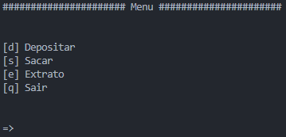
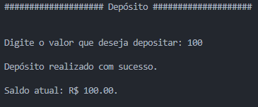
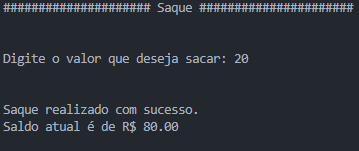
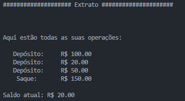

# Simulação de Sistema Bancário 💰
Este script implementa uma simulação básica de um sistema bancário, proposta em um desafio de código do bootcamp **_Potência Tech powered by iFood_**, permitindo que o usuário realize depósitos, saques e consulte o extrato da conta.

Esta é a primeira versão do código, que utiliza apenas os fundamentos do python, com o foco em ser justamente simples.

## Como Utilizar
Execute o script em um ambiente Python.
O menu será exibido, apresentando as opções disponíveis:

Escolha a opção desejada digitando a letra correspondente e pressionando Enter.

### Opção "Depositar" [d]
Ao selecionar a opção "Depositar", você poderá adicionar fundos à conta. Siga as instruções abaixo:
1. Digite o valor que deseja depositar quando solicitado.
2. Certifique-se de inserir um valor maior que zero e que contenha apenas números.
3. Após o depósito ser realizado, uma mensagem de sucesso e o saldo atual será exibido.

### Opção "Sacar" [s]
Ao selecionar a opção "Sacar", você poderá retirar dinheiro da conta. Siga as instruções abaixo:
1. Digite o valor que deseja sacar quando solicitado.
2. Certifique-se de inserir um valor válido, respeitando as seguintes condições:
    - O valor deve ser menor ou igual ao saldo disponível em sua conta.
    - O valor não pode ser superior a R$ 500 (limite de saque).
    - O valor deve ser maior que zero.
3. Após o saque ser realizado com sucesso, o saldo atual será exibido.

Observação: Existe um limite de 3 saques diários e um limite por saque de R$ 500.

### Opção "Extrato" [e]
Ao selecionar a opção "Extrato", você poderá visualizar o histórico de operações e o saldo atual da conta. Siga as instruções abaixo:
1. O extrato será exibido, mostrando todas as operações realizadas.
2. Cada linha do extrato apresentará o tipo de operação (Depósito ou Saque) e o valor correspondente.
3. O saldo atual da conta será exibido no final.

### Opção "Sair" [q]
Ao selecionar a opção "Sair", o programa será encerrado.

## Váriaveis de configuração
- `saldo` Saldo inicial que deve ser 0.
- `limite` Limite de valor para cada operação de saque.
- `extrato` String que armazena as operações já feitas.
- `num_saques` Contador para limitar a quantidade de saques por execução do programa
- `espacador` Quantidade de caracteres usado para centralizar o titulo de cada menu
- `LIMITE_SAQUES` Quantidade máxima de saques por execução do programa
- `SEP` Separador de cada operação para ser armazenado na variável extrato

🏦 Divirta-se utilizando o sistema bancário simulado! 🏦

